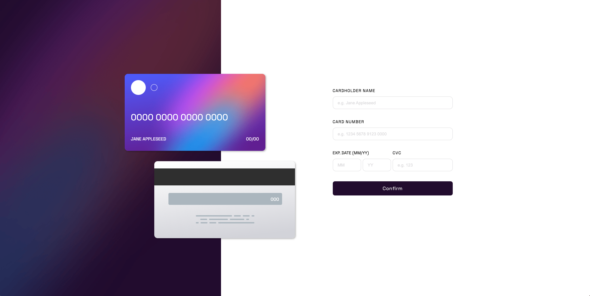
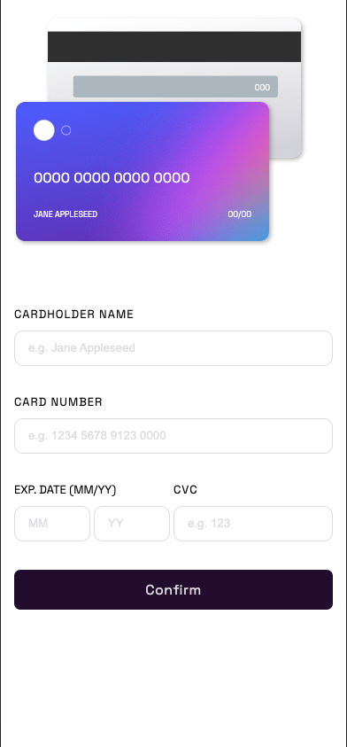
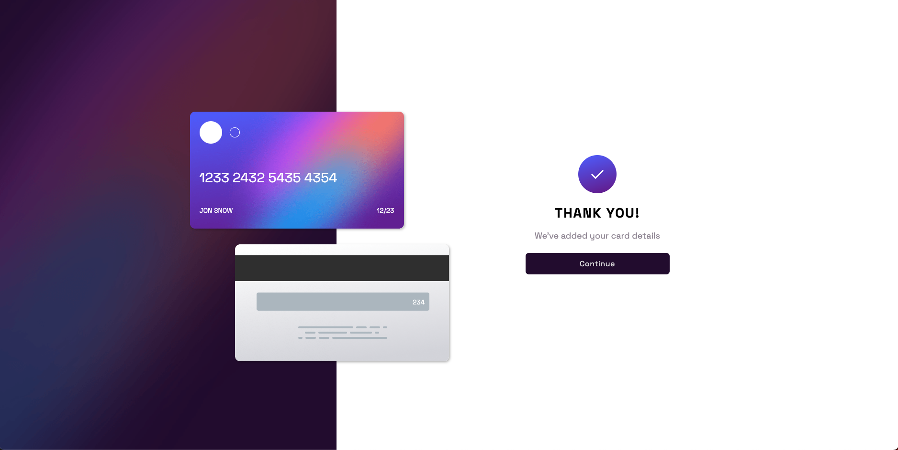
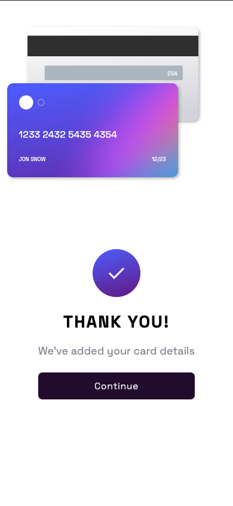

# Frontend Mentor - Interactive card details form

This is a solution to the [Design preview for the Interactive card details form coding challenge](./design/desktop-preview.jpg).

## Table of contents

- [Overview](#overview)
  - [The challenge](#the-challenge)
  - [Screenshot](#screenshot)
  - [Links](#links)
- [My process](#my-process)
  - [Built with](#built-with)
  - [What I learned](#what-i-learned)
  - [Continued development](#continued-development)
  - [Useful resources](#useful-resources)
- [Author](#author)
- [Acknowledgments](#acknowledgments)

## Overview

### The challenge

Users should be able to:

- Fill in the form and see the card details update in real-time
- Receive error messages when the form is submitted if:
  - Any input field is empty
  - The card number, expiry date, or CVC fields are in the wrong format
- View the optimal layout depending on their device's screen size
- See hover, active, and focus states for interactive elements on the page

### Expected behaviour

- Update the details on the card as the user fills in the fields
- Validate the form fields when the form is submitted
- If there are no errors, display the completed state
- Reset the form when the user clicks "Continue" on the completed state

### Screenshot

### Links

- [Solution URL](https://github.com/R3sty/interactive-credit-card-form)
- [Live site URL](https://r3sty.github.io/interactive-credit-card-form/)

## My process

This was my first time working with SCSS, and I must say it was quite an experience. I had to learn the syntax and how to use mixins, variables, and nesting to create reusable styles. It was a bit challenging at first, but with time and practice, it became easier.

Another thing I learned while working on this challenge was the use of context providers in React + TypeScript. I discovered how to manage state in larger applications and streamline code by using context providers. This has been an eye-opener for me, and I am excited to apply it in future projects.

### Built with

- Sass
- Mobile-first workflow
- [React](https://reactjs.org/)

### What I learned

Completing this challenge was a significant milestone in my frontend development journey. I enjoyed learning new skills and techniques while building a beautiful and responsive pricing component. I am grateful for the opportunity, and I look forward to more exciting challenges in the future.

### Useful resources

I learned a lot of practical tips from @TheCoderCoder. She helped me with setting up SCSS and understanding the basics.

## Author

- Frontend Mentor - [@R3sty](https://www.frontendmentor.io/profile/R3sty)
- Twitter - [@R3xist](https://twitter.com/R3XIST)
